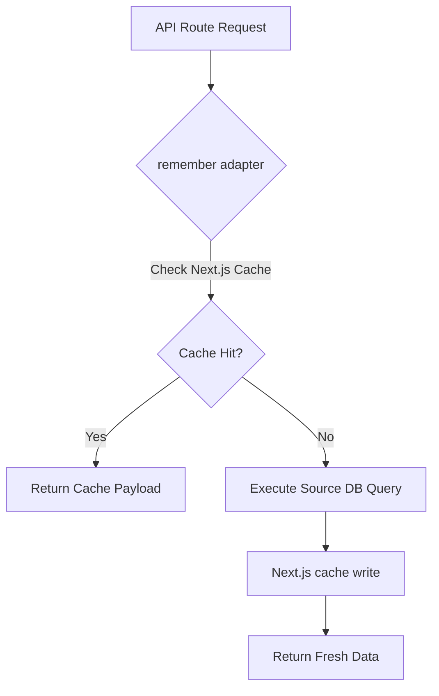

# Caching Architecture Developer Guide

This guide details the Next.js Data Cache architecture, tag naming conventions, and best practices for managing cache states across the ERP application.

---

## 1. Caching Architecture Overview (The Adapter Pattern)

The College ERP uses Next.js's native Data Cache (`unstable_cache` and `revalidateTag`) for caching heavy read-biased payloads, keeping database queries minimal. To maintain architectural flexibility (e.g. for a future VPS migration or custom cache handler), we isolate the caching implementation behind a vendor-agnostic **Adapter Pattern**. 

All API routes consume generic `remember()` and `clearCache()` wrapper functions from `@/app/lib/cache`, remaining completely oblivious to whether the caching backend is Next.js, Redis, or an in-memory store.



### The `remember()` Wrapper
All read endpoints load data using the centralized `remember` helper in `app/lib/cache.ts`. 

Key architectural traits:
* **JSON Serialization**: Next.js Data Cache automatically serializes and deserializes payloads.
* **Automatic Tagging**: The wrapper registers the cache entry with a primary key tag and optional invalidation tags.

---

## 2. Tag Naming Philosophy & Tag Builders

To avoid fragmented keys, all cache tags are constructed using deterministic tag builders in `app/lib/cache.ts`.

### Tag Namespace Pattern
All tags follow a standard colon-separated namespace prefix:
```
erp:<feature>:<scope>[:subscope]
```

| Scope Level | Pattern | Example Tag | Usage |
| :--- | :--- | :--- | :--- |
| **User** | `erp:dashboard:user:${userId}` | `erp:dashboard:user:42` | Personal student dashboard data |
| **Faculty** | `erp:timetable:faculty:${facultyId}` | `erp:timetable:faculty:109` | Faculty schedules |
| **Division** | `erp:timetable:division:${divisionId}` | `erp:timetable:division:4` | Shared timetable schedules |
| **Division & Semester** | `erp:subjects:division:${divisionId}:semester:${semesterId}` | `erp:subjects:division:4:semester:2` | Subject lists |
| **Circular Visibilities** | `erp:circulars:global` / `erp:circulars:division:${divisionId}` | `erp:circulars:division:12` | Filtered circular segments |
| **Attendance** | `erp:attendance:division:${divisionId}` | `erp:attendance:division:4` | Division session logs |
| **Admin Lists** | `erp:admin:divisions:list:page:${page}...` | `erp:admin:divisions:list:page:1:limit:1000` | Paginated lists |

---

## 3. The Next.js Tagging Superpower (Multi-Tagging)

Next.js tags are many-to-many. A single cached query can register multiple tags, and invalidating *any* of those tags will instantly purge that entry. We leverage this to implement division-wide invalidations efficiently:

1. **Dashboard GET Route**:
   When a student fetches their dashboard, we cache the result with:
   - Primary tag: `cacheTags.dashboard.user(userId)`
   - Extra invalidation tag: `cacheTags.dashboard.division(divisionId)`
2. **Division Invalidation (e.g. Timetable/Attendance edits)**:
   Instead of querying the database for all student IDs in the division and looping to invalidate them, we call:
   ```typescript
   await clearCache(cacheTags.dashboard.division(divisionId));
   ```
   This instantly purges all student dashboards in that division in one step.

---

## 4. TTL (Time-To-Live) Philosophy

TTL configurations are managed centrally in `app/lib/cache.ts` inside the `CACHE_CONFIG` object (defined in hours, and mapped to seconds internally):

```typescript
export const TTL = {
  DASHBOARD: hoursToSeconds(2),
  TIMETABLE: hoursToSeconds(12),
  SUBJECTS: hoursToSeconds(24),
  CIRCULARS: hoursToSeconds(6),
  ATTENDANCE: hoursToSeconds(1),
} as const;
```

---

## 5. Event-Driven Invalidation Philosophy

Instead of relying on short TTL values to expire stale data, we use **event-driven cache invalidations**. 

Whenever data is mutated, the write API endpoint triggers an invalidation:

```
[Write/Mutation Triggered] ──> [Database update succeeds] ──> [Call clearCache(tag)] ──> [Next.js purges tag]
```

---

## 6. Examples for Future Developers

### Reading Cached Data (GET Handler)
```typescript
import { remember, cacheTags, TTL } from "@/app/lib/cache";

export async function GET(req: NextRequest) {
  const divisionId = 4;
  const semesterId = 2;

  const subjectsData = await remember(
    cacheTags.subjects.division(divisionId, semesterId),
    TTL.SUBJECTS,
    async () => {
      // Direct database query on cache miss
      return await db
        .select()
        .from(subjects)
        .where(eq(subjects.divisionId, divisionId));
    }
  );

  return NextResponse.json({ success: true, data: subjectsData });
}
```

### Mutating Data & Invalidation (POST/PUT/DELETE Handler)
```typescript
import { cacheTags, clearCache } from "@/app/lib/cache";

export async function POST(req: NextRequest) {
  const { divisionId, semesterId, name } = await req.json();

  // 1. Mutate DB
  await db.insert(subjects).values({ divisionId, semesterId, name });

  // 2. Invalidate division subjects cache
  await clearCache(cacheTags.subjects.division(divisionId, semesterId));

  return NextResponse.json({ success: true, message: "Created subject" });
}
```

---

## 7. Best Practices & Common Mistakes

### Best Practices
* **Always use `cacheTags` builders**: Never construct cache key strings ad-hoc.
* **Register multi-tags where appropriate**: Associate a division tag with user dashboard queries if division-level actions should invalidate them.
* **Handle Next.js typing issues**: Note that `revalidateTag` might expect a second argument in some experimental configurations. Use `(revalidateTag as any)(tag)` within `clearCache` to ensure type compatibility.

### Common Mistakes to Avoid
* **Importing `next/cache` or `unstable_cache` in API routes**: Always use the wrappers in `@/app/lib/cache` to maintain vendor independence.
* **Database loops for cache clearing**: Never query the database for individual member IDs just to invalidate their caches in a loop. Use multi-tagging.
* **Missing Invalidation Triggers**: Forgetting to add cache invalidation hooks in administrative bulk-saving scripts or new integration pipelines.
