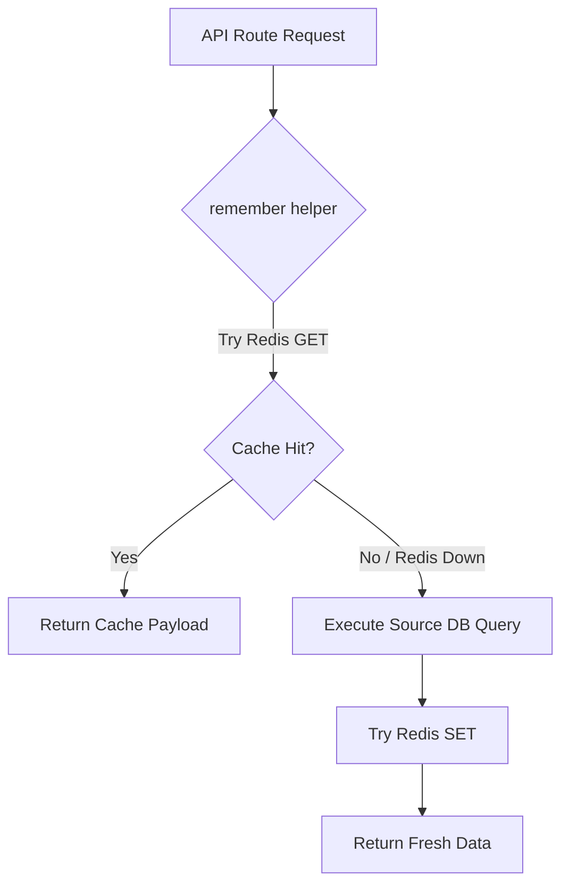

# Redis Caching Architecture Developer Guide

This guide details the Redis caching design system, key naming conventions, and best practices for extending caching capabilities across the ERP application.

---

## 1. Redis Caching Architecture Overview

The caching layer uses `@upstash/redis` to store serialized JSON payloads. To ensure high availability and resistance to connection failures, all caching reads and writes are wrapped in a fallback structure.



### The `remember()` Wrapper
All read endpoints query Redis via the centralized `remember` helper in `app/lib/cache.ts`. 

Key architectural traits:
* **Silent Fallback**: If Redis becomes unreachable (due to network partitions, auth issues, or rate limits), the wrapper catches the error, logs a warning, and directly resolves the fresh database query. The application remains fully functional.
* **Automatic Serialization**: JSON serialization and parsing are handled internally by the helper.
* **Execution Profiling**: The wrapper integrates with `RequestProfiler` to record cache execution latency.

---

## 2. Key Naming Philosophy & Key Builders

To avoid fragmented and unmanageable keys, all Redis keys are constructed using deterministic key builders in `app/lib/cache.ts`. 

### Key Namespace Pattern
All keys follow a standard colon-separated namespace prefix:
```
erp:<feature>:<scope>[:subscope]
```

| Scope Level | Pattern | Example Key | Usage |
| :--- | :--- | :--- | :--- |
| **User** | `erp:dashboard:user:${userId}` | `erp:dashboard:user:42` | Highly personalized data (e.g. dashboards) |
| **Faculty** | `erp:timetable:faculty:${facultyId}` | `erp:timetable:faculty:109` | Faculty schedules |
| **Division** | `erp:timetable:division:${divisionId}` | `erp:timetable:division:4` | Shared timetable schedules |
| **Division & Semester** | `erp:subjects:division:${divisionId}:semester:${semesterId}` | `erp:subjects:division:4:semester:2` | Subject assignments |
| **Circular Visibilities** | `erp:circulars:global` / `erp:circulars:division:${divisionId}` | `erp:circulars:division:12` | Filtered segments |
| **Attendance** | `erp:attendance:division:${divisionId}` | `erp:attendance:division:4` | Division session history |

> [!IMPORTANT]
> Do NOT create user-specific cache keys when the underlying data is identical for everyone in their group. For example, use `erp:timetable:division:4` for all students in Division 4, instead of segmenting by student ID.

---

## 3. Scoping & Shared Caching Strategy

The scoping of keys dictates how cache is shared and re-used across different user roles:

1. **Division-Scoped Keys**: Used for data shared by an entire classroom (Timetables, Subject Listings, and Attendance Ledger). When any student in the division requests their timetable, they hit the same shared division cache, resulting in a **high cache hit ratio**.
2. **User-Scoped Keys**: Used only when data has personal metrics or state (e.g., student dashboards containing their specific attendance percentages, or a faculty member's personalized profile).
3. **Year & Global Scoped Keys**: Useful for announcements or circulars that target whole cohorts (e.g., Year 1 students or all active faculty members).

---

## 4. TTL (Time-To-Live) Philosophy

TTL configurations are managed centrally in `app/lib/cache.ts` inside the `CACHE_CONFIG` object (defined in hours as per specification, and mapped to seconds internally):

```typescript
export const CACHE_CONFIG = {
  DASHBOARD_HOURS: 2,
  TIMETABLE_HOURS: 12,
  SUBJECTS_HOURS: 24,
  CIRCULARS_HOURS: 6,
  ATTENDANCE_HOURS: 1,
} as const;
```

* **Dashboard (2 Hours)**: Short TTL to ensure dashboard widgets remain reasonably fresh while protecting the database from repetitive page refreshes.
* **Timetables (12 Hours)**: Timetables are static resources that rarely change throughout the semester.
* **Subjects (24 Hours)**: High TTL since subject assignments are set once at the start of the academic cycle.
* **Attendance (1 Hour)**: Cached sessions are held briefly for counselors and HODs who browse division logs.

---

## 5. Event-Driven Invalidation Philosophy

Instead of relying on short TTL values to expire stale data, we use **event-driven cache invalidations**. 

Whenever data is mutated, the write API endpoint triggers an invalidation:

```
[HOD/Faculty writes change] ──> [Database update succeeds] ──> [Trigger Invalidation Helper] ──> [Delete cached keys in Redis]
```

### Invalidation Helpers
We implement specific event helpers in `app/lib/cache.ts`:
* `invalidateTimetableUpdated(divisionId)`: Invalidates the division timetable cache and pipelines student dashboard invalidations for everyone in that division.
* `invalidateAttendanceUpdated(divisionId)`: Invalidates the division-scoped attendance ledger.
* `invalidateSubjectsUpdated(divisionId, semesterId)`: Clears the subjects list cache.
* `invalidateCircularUpdated(circularPayload)`: Invalidates the relevant visibility segments depending on the circular type (Global, Faculty, Year, or Division).

---

## 6. Examples for Future Developers

### Reading Cached Data (GET Handler)
```typescript
import { remember, cacheKeys, TTL } from "@/app/lib/cache";

export async function GET(req: NextRequest) {
  const divisionId = 4;
  const semesterId = 2;

  const subjectsData = await remember(
    cacheKeys.subjects.division(divisionId, semesterId),
    TTL.SUBJECTS,
    async () => {
      // Direct database query on cache miss
      return await db
        .select()
        .from(subjects)
        .where(eq(subjects.divisionId, divisionId));
    }
  );

  return NextResponse.json({ success: true, data: subjectsData });
}
```

### Mutating Data & Invalidation (POST/PUT/DELETE Handler)
```typescript
import { invalidateSubjectsUpdated } from "@/app/lib/cache";

export async function POST(req: NextRequest) {
  const { divisionId, semesterId, name } = await req.json();

  // 1. Mutate DB
  await db.insert(subjects).values({ divisionId, semesterId, name });

  // 2. Invalidate Cache
  await invalidateSubjectsUpdated(divisionId, semesterId);

  return NextResponse.json({ success: true, message: "Created subject" });
}
```

---

## 7. Best Practices & Common Mistakes

### Best Practices
* **Use the Key Builders**: Never construct key strings ad-hoc. Always define a helper function in `cacheKeys` to avoid key mismatch bugs.
* **Deduplicate In-Memory**: Fetch all visibility caches concurrently (e.g. for Circulars) and merge/deduplicate in-memory to minimize Redis network trips.
* **Pipeline Division Dashboards**: If invalidating dashboards for all students in a division, use `redis.pipeline()` to delete all keys in a single round-trip.

### Common Mistakes to Avoid
* **Hardcoding Redis Keys**: Writing `"dashboard:" + userId` in an API route instead of `cacheKeys.dashboard.user(userId)`.
* **Not Scoping by Active Semester**: Storing keys like `erp:subjects:division:4` without including the semester ID (this can corrupt historical data when the division shifts semesters).
* **Missing Invalidation Triggers**: Forgetting to add cache invalidation hooks in administrative bulk-saving scripts or new integration pipelines.
* **Ignoring Type Annonations**: Declaring variables that contain cached payloads without explicit type annotations, causing `noImplicitAny` compilation failures during build step.
