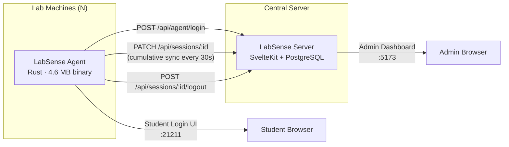
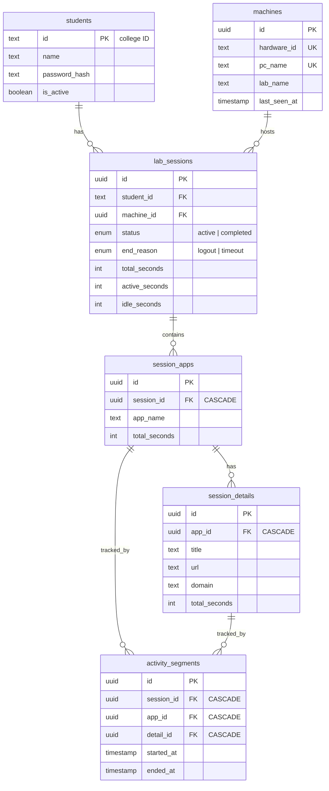

# LabSense — Institutional Lab Monitoring Service

> Real-time student session analytics for educational computer labs

---

## Executive Summary

LabSense is a lightweight, privacy-conscious monitoring system designed for educational institutions to track student computer lab usage in real time. It consists of two components:

1. **LabSense Agent** — A native Windows background service written in **Rust** that silently monitors foreground application usage, browser activity, and idle patterns, syncing cumulative analytics to a central server.

2. **LabSense Server** — A **SvelteKit** web application backed by **PostgreSQL** that provides an administrative dashboard for session management, student monitoring, machine tracking, and usage analytics.

---

## Architecture



### Data Flow

1. Student launches browser on lab PC → Agent opens login UI at `http://127.0.0.1:21211`
2. Student enters credentials → Agent authenticates via server API
3. Server creates session, returns runtime config (sync interval, feature flags, thresholds)
4. Agent begins monitoring: polls foreground app every ~1 second
5. Every 30s (+ random jitter), agent sends cumulative snapshot to server via PATCH
6. On logout (or timeout), session is marked completed with reason

---

## Agent — Technical Specifications

### Performance Profile

| Metric | Value |
|--------|-------|
| **Private RAM** | **< 10 MB** (peak working set) |
| **CPU Usage** | **< 0.1%** sustained (most ticks) |
| **Binary Size** | **4.6 MB** (release, LTO + strip) |
| **Source Code** | 2,379 lines across 16 Rust files (~89 KB) |
| **Poll Interval** | 1 second (foreground app check) |
| **Sync Interval** | Configurable (default 30s + 0–30s jitter) |

### Module Breakdown

| Module | Responsibility | Key Technique |
|--------|---------------|---------------|
| `monitor/foreground.rs` | Detect active window + process | Win32 `GetForegroundWindow` → `GetWindowThreadProcessId` → `sysinfo` process name |
| `monitor/idle.rs` | Detect keyboard/mouse inactivity | Win32 `GetLastInputInfo` → tick delta |
| `monitor/uia.rs` | Extract browser URL bar content | UIAutomation `IUIAutomationValuePattern` on Edit controls |
| `monitor/normalizer.rs` | Map raw windows to clean identities | Domain-based normalization with PSL (`addr` crate), 100+ app mappings, auth page protection |
| `analytics.rs` | Cumulative session counters + timeline segments | `HashMap<AppIdentity>` with bounded segment buffers and shortest-duration eviction |
| `sync_loop.rs` | Periodic server synchronization | Jittered interval, cumulative snapshots, conflict/404 auto-recovery |
| `monitor_loop.rs` | 1-second foreground polling loop | Window cache (HWND + title) to skip redundant UIA extraction |
| `session.rs` | Session state machine (Idle ↔ Active) | `parking_lot::Mutex` shared state with runtime config from server |
| `service.rs` | Windows Service (SCM) integration | `windows-service` crate, proper start/stop lifecycle |
| `web_ui/` | Embedded student login interface | `rust-embed` for zero-file-dependency deployment; `warp` HTTP on port 21211 |
| `config.rs` | Local configuration | JSON config from `C:\Program Files\LabSense\config.json` or CWD fallback |
| `hardware.rs` | Stable machine fingerprint | `machine-uid` (Windows MachineGuid registry key) |

---

## Unique Selling Points (USPs)

### 1. 🦀 Native Rust — Zero Runtime Overhead
Unlike Electron/Node/Python monitoring agents, LabSense compiles to a **single 4.6 MB native binary** with no runtime dependencies. No JVM, no .NET CLR, no Python interpreter. The agent runs at < 10 MB private RAM and < 0.1% CPU — virtually invisible on student machines.

### 2. 🧠 Intelligent Browser Normalization
The agent doesn't just log "chrome.exe" — it:
- Extracts the **actual URL** from the browser address bar via Windows UIAutomation
- Resolves the **registrable domain** using the Public Suffix List (`addr` crate) — correctly handling `co.uk`, `com.au`, etc.
- Maps domains to **human-friendly names** (e.g., `chatgpt.com` → "ChatGPT", `docs.google.com` → "Google Docs")
- **Strips sensitive URLs** — authentication pages (`accounts.google.com`, `login.microsoftonline.com`) are normalized to generic labels, never stored
- **Sanitizes query parameters** — only whitelisted params (`v`, `id`, `q`) are retained; tokens, UTM params, and session IDs are stripped

### 3. 📊 Hierarchical Timeline Tracking
Activity is tracked in a **two-level hierarchy**:
- **App level:** "ChatGPT" → 120 total seconds, 5 activity segments
- **Detail level:** "Runtime Config Architecture" on `chatgpt.com/c/abc123` → 80 seconds, 3 segments

Each segment records `(started_at, ended_at)` timestamps. Segments extend automatically when activity is continuous (gap ≤ 2s), and new segments are created on context switches. A **shortest-duration eviction** strategy keeps the segment buffer bounded (configurable, default 50 per app).

### 4. 🔒 Privacy-by-Design
- **No screen capture** — only process names, window titles, and browser URLs are observed
- **No keylogging** — only keyboard/mouse *activity detection* (idle threshold), never keystrokes
- **URL sanitization** — query params stripped, auth pages blocked, fragments removed
- **Timer stripping** — YouTube/Spotify timer prefixes (e.g., `"0:01 - Song Name"`) are cleaned from titles
- **Title deduplication** — notifications like `"WhatsApp (2)"` merge into a single "WhatsApp" identity

### 5. ⚙️ Server-Driven Runtime Configuration
All monitoring parameters are **controlled centrally** from the admin dashboard — no agent redeployment needed:

| Parameter | Default | Description |
|-----------|---------|-------------|
| `syncIntervalSeconds` | 30 | How often agent syncs to server |
| `syncJitterSeconds` | 30 | Random jitter added to prevent thundering herd |
| `timeoutSeconds` | 120 | Auto-end session if agent stops syncing |
| `idleThresholdSeconds` | 120 | Seconds of inactivity before marking idle |
| `enableDetails` | true | Track per-page/per-tab browser details |
| `enableSegments` | true | Track activity timeline segments |
| `maxSegmentsPerApp` | 50 | Memory cap on timeline segments |
| `minimumTrackedSeconds` | 15 | Transient apps below this are pruned |
| `candidateRetentionMinutes` | 10 | How long to keep unconfirmed short-lived apps |

### 6. 🪟 Windows Service Integration
The agent runs as a proper **Windows Service** (`LabSenseAgent`) via the Service Control Manager. This means:
- Starts automatically at boot (before any user logs in)
- Survives user logoff/logon cycles
- Can be managed via `services.msc` or `sc.exe`
- Graceful stop signaling (no data loss on service stop)
- Console mode available for development (`--service` flag switches modes)

### 7. 🧹 Self-Cleaning Memory Management
The agent employs multiple strategies to stay under its ~10 MB memory budget:
- **Candidate pruning** — Apps with < 15s total usage are auto-evicted after 10 minutes of inactivity
- **Detail capping** — Max 100 detail entries per app (LRU by `total_seconds`)
- **Segment eviction** — Shortest-duration segments are evicted when buffer exceeds cap
- **Window cache** — Reuses normalized identity when HWND + title haven't changed (avoids redundant UIA calls + allocations)
- **Feature gating** — When `enableDetails` or `enableSegments` is false, the corresponding `HashMap`/`Vec` is `None` (zero allocation, not empty collection)

### 8. 📡 Cumulative Snapshot Sync Model
Unlike event-streaming architectures that require reliable delivery and ordering, LabSense uses **cumulative snapshots**:
- Each sync sends the **full current state**, not deltas
- If a sync fails, the next one naturally includes all data — no replay or acknowledgment needed
- Server uses `SET` semantics (not `INCREMENT`) — idempotent by design
- Conflict detection: if server returns 404 (session lost) or 409 (already completed), agent self-heals by deactivating locally

---

## Server — Admin Dashboard

### Technology Stack
- **SvelteKit** (SSR + form actions)
- **PostgreSQL** (via Drizzle ORM)
- **Argon2id** password hashing (`@node-rs/argon2` native binding)
- **Cookie-based** admin authentication (1-hour sessions)

### Dashboard Modules

| Module | Route | Features |
|--------|-------|----------|
| **Dashboard** | `/app` | Total students, active sessions, machines, hours today, 7-day usage chart, recent sessions |
| **Students** | `/app/students` | Student list, search, bulk import, add, edit, delete (admin-password-protected) |
| **Student Detail** | `/app/students/[id]` | Per-student stats, session history with date filtering |
| **Session Report** | `/app/students/[id]/[sessionId]` | App usage breakdown, session metadata, delete action |
| **App Detail** | `/app/students/[id]/[sessionId]/[appId]` | Browsing details table, activity timeline segments |
| **Labs / Machines** | `/app/labs` | Machine inventory, status (online/offline), lab filtering |
| **Machine Detail** | `/app/labs/[id]` | Per-machine stats, session history, edit/delete |
| **System Settings** | `/app/settings` | All runtime config knobs (password-protected) |

### Database Schema



### API Endpoints

| Method | Endpoint | Auth | Description |
|--------|----------|------|-------------|
| `POST` | `/api/agent/login` | None (CORS *) | Student login → create session |
| `PATCH` | `/api/sessions/:id` | None (CORS *) | Cumulative analytics sync |
| `POST` | `/api/sessions/:id/logout` | None (CORS *) | End session (reason: logout) |

> Agent API endpoints use permissive CORS (`Access-Control-Allow-Origin: *`) for LAN communication. Admin dashboard routes use cookie-based session auth.

### Background Services

- **Timeout Sweeper** — Runs every 30 seconds. Reads `timeoutSeconds` from `system_settings` and batch-marks stale active sessions as `completed` with `end_reason = timeout`. Changes to timeout settings take effect immediately without server restart.

---

## Deployment Model

```
Lab Machine (Windows)
├── C:\Program Files\LabSense\
│   ├── labsense-agent.exe    (4.6 MB — single binary, all assets embedded)
│   └── config.json            (serverUrl, pcName, labName)
└── Windows Service: LabSenseAgent (auto-start)

Central Server (Linux/Docker)
├── SvelteKit app              (Node.js)
├── PostgreSQL                 (persistent storage)
└── .env                       (DATABASE_URL, PASSWD)
```

**Zero client-side dependencies.** The agent binary includes the embedded web UI (HTML/CSS/JS compiled via `rust-embed`), the HTTP server (`warp`), and all monitoring logic. No installer framework, no runtime, no DLLs.

---

## Security Model

| Layer | Mechanism |
|-------|-----------|
| **Student auth** | Argon2id (2 iterations, 32 MB memory, peppered) — verified server-side |
| **Admin auth** | Argon2id + cookie sessions (1-hour expiry, HttpOnly, SameSite=Lax) |
| **Settings protection** | Separate confirmation password for config changes |
| **Student management** | Admin password re-verification for edit/delete operations |
| **URL privacy** | Query param stripping, auth page blocking, fragment removal |
| **Network** | Agent listens only on `127.0.0.1:21211` (loopback — not reachable from network) |
| **Machine identity** | Stable hardware fingerprint via Windows `MachineGuid` registry key |

---

## Performance Benchmarks

### Agent Resource Usage (Typical Lab Session)

| Metric | Idle Student | Active Student | Peak |
|--------|-------------|---------------|------|
| **Private Memory** | ~6 MB | ~8 MB | < 10 MB |
| **CPU (%)** | 0.0% | < 0.1% | < 0.3% (during UIA extraction) |
| **Network** | 0 B/s | ~1 KB per sync | ~2 KB (many apps) |
| **Disk I/O** | None | None | None (pure in-memory) |

### Why So Lightweight?

1. **No polling loops for idle** — Single Win32 API call (`GetLastInputInfo`), O(1)
2. **Targeted process refresh** — `sysinfo::refresh_processes` only refreshes the single foreground PID, not the entire process table
3. **Window identity cache** — UIA extraction (the heaviest operation) only runs when HWND or title changes
4. **Feature gating** — Disabled features allocate `None`, not empty collections
5. **No logging to disk** — All analytics are in-memory; only synced via HTTP
6. **Release optimizations** — LTO, single codegen unit, symbol stripping, abort-on-panic

---

*LabSense v0.1.0 — Built with Rust 2021 Edition*
